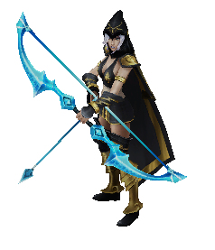

LoL model viewer for mac
====

[ref](http://git.oschina.net/lyricc/LolView/tree/master) A model viewer for LOL game models.

It turns out as Xcode project, and texture are loaded with SOIL, no shaders needed, enjoy! Put .obj and .dds with the executable file when running.

